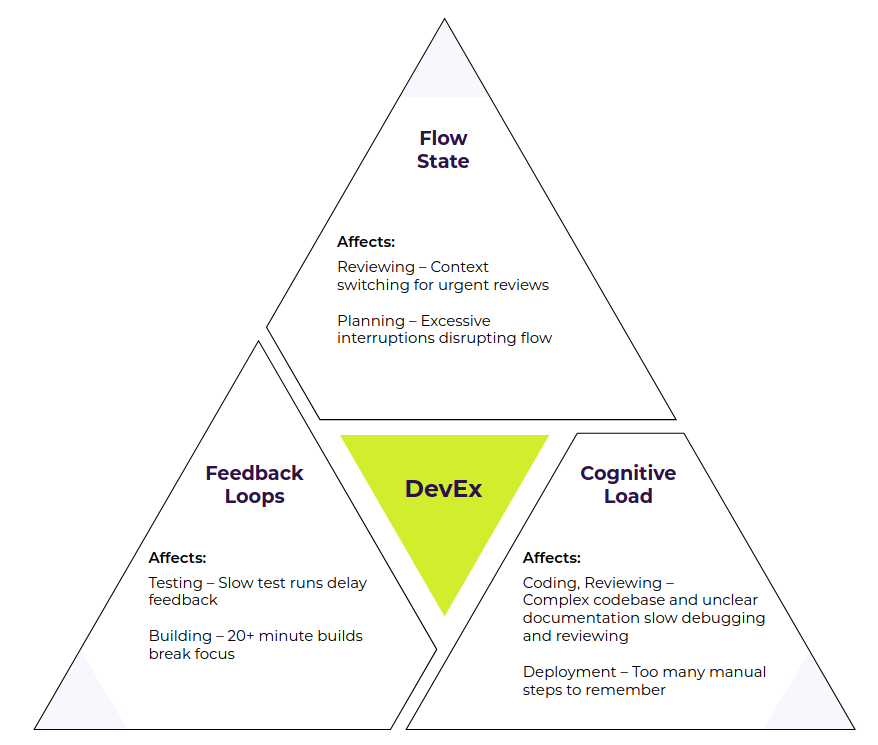

Summary of: Nicole Forsgren & Abi Noda, Frictionless - 7 steps to remove barriers, unlock value and outpace your competition in the AI era.

https://developerexperiencebook.com/ (includes a workbook)

This book is about (improving) developer experience in a broad sense, including processes and way of working. The key concept they use is 'friction'.

**Developer Experience captures the quality of interactions developers have around the tools, processes, and people they work with, trying to get their job done.**

Taking a developer-centric view of software development, you can quickly identify bottlenecks and friction that blocks innovation, quality, and productivity.

AI acceleration makes existing friction even more costly.

Poor DevEx creates a competitive disadvantage that compounds over time.

**Friction = anything that slows down or gets in the way of completing work**

Why "developer experience"? "Productivity" sets off alarm bells, "experience" opens conversations

Developer Experience is about improving 3 things:
1. Feedback loops - e.g. developer needs information, needs to wait, experiences delays; slow feedback interrupts the development process; async work (remote) can make this even worse
2. Flow state - "deep work"; effective feedback loops are crucial for maintaining flow;
3. Cognitive load - excessive cognitive load directly impedes developers' ability to deliver value;

These 3 reinforce each other.

DevEx improvements compound over time.

Business benefits of improving DevEx ("selling DevEx to the business"):
* **recover time**, i.e. more development capacity available
* **save money**: e.g. reducing cloud/infra costs through improvements (e.g. test efficiency); consolidation/standardization
* **make money**
  * accelerate revenue: faster/sooner delivery; higher quality/stability/reliability; deliver smaller batches faster
  * can experiment/iterate/deliver faster
  * i.e. shorter time-to-market

Link technical metrics to business outcomes. Story telling matters more than exact numbers.

Selling it to the business:
* "what keeps you awake at night?"
* translate / correlate benefits to money
* DevEx: from technical "nice to have" to strategic business enabler.

The rest of the book describes a step-by-step approach to work on improving DevEx/reducing friction in your organisation, with a research based/"data driven" approach (both qualitative and quantitative).

TODO: create our own version of this image

