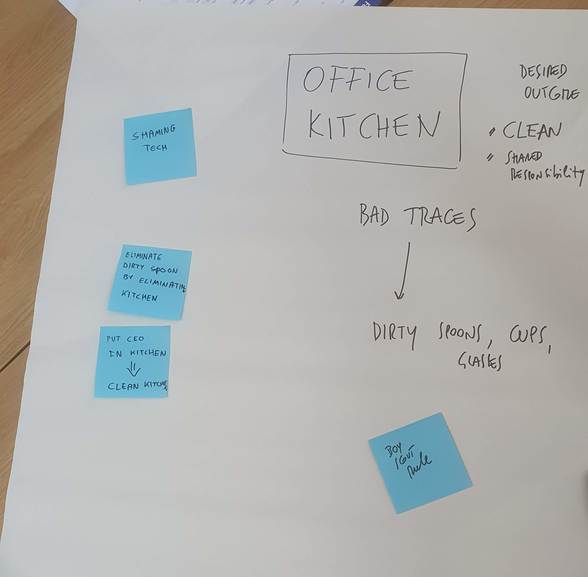
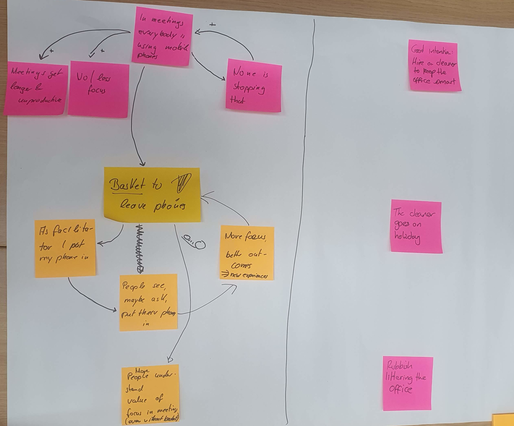

At [Agile Cambridge 2023](https://agilecambridge.net/), Willem and I ran another instance of our Stigmergy workshop.

It is part of a series of workshops at different conference to explore the concept of [stigmergy](https://en.wikipedia.org/wiki/Stigmergy) - *a mechanism of indirect coordination, through the environment, between agents or actions* - within the context of software development (or work in general).

Stigmergy is a concept originally from biology. We are exploring how it can be mapped onto the world of work, as a way of influencing people's behaviour with a limited amount of energy. If the environment influences people's behaviour so that they do things that are desired, we can create a path of least resistance without explicitly instructing, directing, or even policing. And this can work the other way around as well - if their environment guides people to undesired behaviour, we risk having to put in a lot of effort to redirect them. We'd be working against the system, wasting a lot of energy.

Looking at some projects we worked on, we think we see stigmergy at play. This could be changes in the physical environment, keeping close to the original definition of stigmergy. Think of e.g. a visual workspace, or a central coffee machine were developer meet, discuss and get unstuck. We also see stigmergy in the more virtual environment, of the code, tools, documentation, other artifacts we work with. What traces in code can nudge future colleagues (including ourselves) to move in a desired direction?

We are running the workshops to find examples of stigmergy at play, for good or bad. We also want to explore its boundaries - what is stigmergy, what isn't? 

At Agile Cambridge, we had three groups who worked out three different cases:
1. dirty office kitchen
2. people in meetings distracted by their phones
3. getting traction with Architecture Decision Records (ADRs)

## Dirty office kitchen

+text

## Distracted by phones

+text

## Getting traction with Architecture Decision Records

+text

In a follow-up post, we will reflect on what we've learned about what is stigmergy and what isn't in the context of work.

The next Stigmergy workshop will he held at [XP Days Benelux](https://xpdaysbenelux.org/), in Heeze (The Netherlands) - hope to see you there!
