# Iteration Workflow

## Overview Diagram

```mermaid
flowchart TB
    subgraph Planning["📋 Planning Phase"]
        PP[project-planner skill]
        PP --> FJ[features.json]
        PP --> GOALS[GOALS.md]
        PP --> PLAN[plan.md]
        FJ --> ITD[docs/iteration-N.md]
    end

    subgraph Execution["⚙️ Execution Phase"]
        START["/iteration-start"]
        START --> |"reads"| GOALS
        START --> |"reads"| ITD
        START --> |"mark-started"| IS[iteration-state binary]
        IS --> |"updates status"| FJ

        IR[iteration-runner skill]
        START --> IR
        IR --> |"spawns per story"| TASK[Task Agents]
        TASK --> |"TDD loop"| CODE[Write Tests → Implement → Pass]
    end

    subgraph Verification["✅ Verification Phase"]
        CHECK["/iteration-check"]
        CODE --> CHECK
        CHECK --> TESTS[mix test]
        CHECK --> CREDO[mix credo --strict]
        CHECK --> FORMAT[mix format --check]

        TESTS --> CF[credo-fixer skill]
        CF --> |"auto-fix"| CREDO

        CHECK --> TCA[test-coverage-analyzer]
        TCA --> TFJ[docs/test-feedback.json]
        TFJ --> TCI[test-coverage-improver]
        TCI --> |"fix P1/P2 gaps"| NEWTESTS[New Tests]

        CHECK --> |"mark-complete"| IS
        IS --> CRJ[docs/check-result.json]
    end

    subgraph Transition["🔄 Transition Phase"]
        NEXT["/iteration-next"]
        CRJ --> |"validate"| NEXT
        NEXT --> |"updates"| PJ[progress.json]
        NEXT --> |"generates"| PROGRESS[PROGRESS.md]

        TFJ --> TGU[test-guidance-updater]
        TGU --> |"updates"| CONTRIB[CONTRIBUTING.md]
        TGU --> |"adds guidance to"| ITD2[docs/iteration-N+1.md]

        NEXT --> |"creates"| ITD2
        NEXT --> |"updates"| GOALS
    end

    ITD2 --> START

    style Planning fill:#e1f5fe
    style Execution fill:#fff3e0
    style Verification fill:#e8f5e9
    style Transition fill:#f3e5f5
```



## Detailed Flow


## Test Feedback Loop

```mermaid
flowchart LR
    subgraph Iteration1["Iteration N"]
        I1[Implement Features]
        T1[Run Tests]
        A1[Analyze Gaps]
        F1[Fix P1/P2 Gaps]
    end

    subgraph Feedback["📊 Feedback Collection"]
        TF[test-feedback.json]
        A1 --> TF
        TF --> |"coverageTrend"| TREND[Historical P1/P2 counts]
        TF --> |"patternsObserved"| PATTERNS[Common gap patterns]
    end

    subgraph Learning["🧠 Learning Phase"]
        TGU[test-guidance-updater]
        TREND --> TGU
        PATTERNS --> TGU
        TGU --> CONTRIB[CONTRIBUTING.md<br/>Testing Guidelines]
        TGU --> GUIDANCE[Next Iteration<br/>Testing Guidance]
    end

    subgraph Iteration2["Iteration N+1"]
        GUIDANCE --> I2[Implement with Guidance]
        I2 --> T2[Run Tests]
        T2 --> A2[Analyze Gaps]
        A2 --> |"fewer gaps"| RESULT[Improved Coverage]
    end

    I1 --> T1 --> A1 --> F1
    F1 --> TF
    CONTRIB --> I2

    style Feedback fill:#fff9c4
    style Learning fill:#e1bee7
```



## File Flow


## Key Concepts

### JSON-Primary Output
- `features.json` is the source of truth for project structure
- `progress.json` tracks historical completion data
- Markdown files are generated summaries for human readability

### Test Feedback Loop
1. **Iteration N**: Test coverage analyzer finds gaps (P1-P4)
2. **Fix Phase**: P1/P2 gaps are fixed immediately (blocking)
3. **Learning Phase**: `test-guidance-updater` analyzes patterns
4. **Iteration N+1**: Testing guidance prevents recurring gaps

### Status Transitions
```
pending → in_progress → complete
   ↑                        |
   └────────────────────────┘
         (next iteration)
```

### Priority Levels
| Priority | Type | Blocking? |
|----------|------|-----------|
| P1 | Core functionality | Yes |
| P2 | Error handling | Yes |
| P3 | Edge cases | No |
| P4 | Domain-specific | No |
