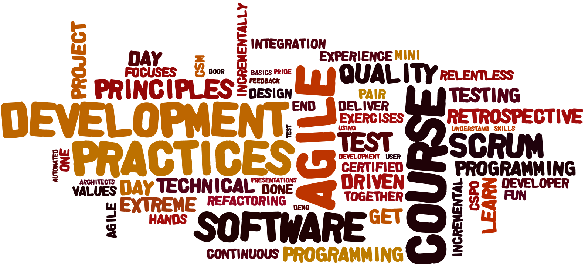

Our training courses are intensive, hands-on. We work with small groups (up to 14 participants) to ensure an optimal learning experience.

We deliver our courses and workshop in English or Dutch. Together with our German and French partners, we can also deliver in Germand or French.

For the exercises in our hands on development skills courses, we can use Java, C#, Scala, Ruby, or Javascript.

We offer both Open Enrollment courses and customized in-company courses. If you have a need that is not covered by an existing course, we are happy 
to make new ones for you. Our best courses got started by specific 
requests from our customers!

<a href="attachments/courses_and_workshops_2016.pdf">Download our training & courses brochure</a>

<h3>Agile Engineering (2 or 3 days)</h3>

When you have learned the basics of agile software development, you might wonder how to actually get things done and get your software out of the door when you go agile. Scrum focuses on coordination and feedback practices, adding technical practices allows teams to grow systems with confidence and safety.

This intensive, hands on course focuses on the down to earth side of working in an agile way: how to plan, build, test, and deploy the software. How to get it done using user stories, test driven development, automated testing, incremental design, relentless refactoring, pair programming, and continuous integration.

This Agile Engineering course is also an excellent way to prepare for the Scrum.org Professional Scrum Developer 1 assessment.

<h4>Benefits</h4>

By participating in course, you will:
<ul>
<li>learn how to deliver projects on-time and within budget, without compromising on quality
<li>see the value of eXtreme Programming principles and practices and how Scrum and eXtreme Programming are complementary
<li>understand how agile values, principles and practices relate
<li>learn how practices like test driven development, relentless refactoring, incremental design, continuous integration, and pair programming support agile principles and enable to deliver quality software incrementally and how they help to keep on delivering quality software over time
<li>learn how one can let quality software evolve iteratively and incrementally
<li>experience the role of testing and test driven development in agile development
<li>experience how all the different practices work together, through a real mini project
<li><strong>... and you’ll have fun!</strong> We take pride in creating a fun and effective learning environment, mixing presentations with simulations, exercises and hands-on development.
</ul>

<h4>Topics</h4>

eXtreme Programming – values, principles &amp; practices; user stories &amp; specification by example; test driven development &amp; merciless refactoring; 
agile architecture &amp; incremental design; responsibility drivend design and CRC cards; bringing it all together, in a 3 iteration micro project

<h3>Mastering Legacy Code (2 days)</h3>

In this two day training course, you will learn how to improve the
design of software step by step, while continuing to deliver value to
your customers.

Everyone wants software that ‘just works’, that is a joy to maintain,
and where you can add new features easily. In practice however, there
are always bugs to fix and customers to please. Corners are cut and
design debt accumulates, ultimately resulting in *legacy code* – code
without tests.

You would like to improve the software piecemeal using *refactoring*-
which means improving the design of existing code without changing its
behaviour. There is a Catch-22 here: to refactor safely, you need
automated tests to ensure the code behaves the same as before. To add
tests, you first have to make it modular by refactoring.

There still is hope! Through presentations, demonstrations, exercises,
and a representative case, you will learn to identify smells, break
dependencies, refactor, and add tests in messy legacy code, so that you
can add new features with more ease and confidence.

The techniques taught in this course are also useful in *greenfield*
projects, to prevent the software from turning into legacy code. They
help you to recover quickly from mistakes and learn from them.

This course helps you get started and offers effective practices and
courage to persevere.

<h4>Benefits</h4>

If you participate in this course, you will:
<ul>
<li>apply a number of techniques to break unwanted dependencies in code
<li>know how to start making changes and adding tests simply responsibly
<li>be able to find *seams* in code and use them to break dependencies
<li>understand the system dynamics of design debt
<li>experience prioritizing, planning, and executing a large refactoring in small steps with a team, on real, representative legacy code.
<li><strong>...and have fun! </strong>- we take pride in creating a fun and effective learning
 environment, mixing presentations with exercises and hands-development.
</ul>

 <h4>Topics</h4>

 
The first day is introductory, with an overview of refactorings, code
 smells, and how to break dependencies by finding seams in the code. We
 will do this through a mix of presentations, demonstrations and small
 exercises. You will also learn about the systemic causes and effects of
 design debt and how refactoring in small steps can help you break out of
 a vicious cycle.

 
Day two is the hands-on day. In two parts we will plan and execute a
 large refactoring on a real-world legacy system. Participants are
 coached in applying what they have learnt: working on a large, messy
 legacy code base without getting lost, using the vocabulary of smells,
 refactorings, seams, and dependencies to co-ordinate, plan and execute a
 large refactoring with a team. And do so safely, even though in the
 beginning no automated tests are present.
 
<h3>Test Driven Development Masterclass (2 days)</h3>

In this in depth practical course, you will learn Test Driven Development and master different unit testing techniques, like mocking and unit testing in legacy code.

The focus of this course is on improving your unit testing skills, getting a better understanding of what a unit test is,
optimizing test scope and performance, and learning techniques and guidelines for writing and maintaining unit tests.

<h4>Benefits</h4>

 By participating in this course, you will:
<ul>
<li>apply test driven development and mocking techniques to test code in isolation
<li>apply a number of techniques to break unwanted dependencies in code
<li>know how to start making changes and adding tests simply and responsibly
<li>know how to evaluate and improve your unit tests
<li>understand the system dynamics of unit testing and design debt
<li>i<strong>... and have fun!</strong> – we take pride in creating a fun and effective learning environment, mixing presentations with exercises and hands-on development.
</ul>

<h4>Topics</h4>

The course consists of a mix of short presentations, live programming demonstrations, and lots of programming exercises.
<ul>
<li>Why Unit Testing? – short and long term systemic effects
<li>Test Driven Development
<li>Taking Test Driven Development to the extreme
<li>Responsibility Driven Design with mocking
<li>Interaction based vs. state based testing
<li>Mocking Styles – when to use mocks, stubs, fakes, and dummies
<li>Getting Your Tests In: Breaking Dependencies in Code
</ul>

<h3>Systemic Thinking for Sustainable Delivery (1 day)</h3>

In our work, we have noticed that changing your software development
method changes your organisation. We have run into questions like:
<ul>
<li>Why can’t the customer keep up with the development team and what can be done about it?
<li>Why is it so hard to introduce agile in some organizations?
<li>What are common failure modes of agile transitions and what can we do to work around these?
<li>How can we get a team to start unit testing (or any other good technical practice)? Is lack of unit testing really the biggest problem?
<li>What are the underlying dynamics of adding people to a project and how can we use these to increase project velocity?
</ul>

While several development methodologies describe a recipe for practices
that worked in a specific context, the exact same recipe is not
guaranteed to work in all circumstances.

Along our journey we have discovered and mastered a number of useful
                thinking and doing tools that help us become better reflective
                practitioners and find answers to the above questions, tools that we
                have found useful in making sense of what’s happening in our
organizations.

<h4>Benefits</h4>

                This course helps you to effect substantial change in small,
                controllable steps, and prevent local (sub)optimization. Understanding
                why your process works the way it works helps you see the extent to
                which a practice is effective in its context. It also helps your
organization grow its own way of developing software.

After participating in this course you will:
<ul>
<li>view software organizations from a different, systemic perspective
<li>find root causes for all kinds of persistent, messy team problems
<li>understand why different software organization work and can work and
why they sometimes stop working effectively
<li>adapt your change initiatives to the specific organizational context
<li>understand how change happens in individuals and organizations, and
what this means for steering a change process
</ul>

